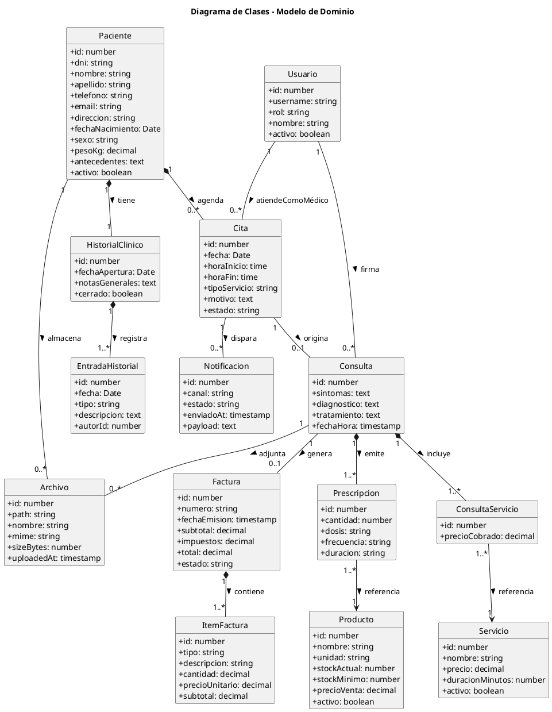

# Diagrama de Clases - Consultorio Las Gaviotas

**Fase:** Elaboración (RUP)
**Notación:** PlantUML

---

## Diagrama de Clases

---

## Multiplicidad (cardinalidad) explícita

| Relación | Multiplicidad | Lectura |
|---|---|---|
| Paciente → HistorialClínico | `1` a `1` | Cada paciente tiene exactamente un historial clínico |
| Historial → Entrada | `1` a `1..*` | Un historial registra una o varias entradas a lo largo del tiempo |
| Paciente → Cita | `1` a `0..*` | Una paciente puede tener ninguna o varias citas |
| Cita → Consulta | `1` a `0..1` | Una cita origina a lo sumo una consulta |
| Consulta → Prescripción | `1` a `1..*` | Una consulta puede tener una o varias prescripciones |
| Consulta → Servicio | `1` a `1..*` | Una consulta puede incluir uno o varios servicios |
| Prescripción → Producto | `*..1` a `1` | Una prescripción referencia exactamente un producto |
| Consulta → Servicio (vía ConsultaServicio) | `*..1` a `1` | Asociación N:M controlada con atributos |
| Consulta → Factura | `1` a `0..1` | Una consulta origina a lo sumo una factura |
| Factura → ItemFactura | `1` a `1..*` | Una factura contiene uno o varios ítems |
| Usuario (rol MEDICO) → Cita | `1` a `0..*` | Un médico atiende varias citas |
| Usuario (rol MEDICO) → Consulta | `1` a `0..*` | Un médico firma varias consultas |

---

## Notas de Diseño

- **Usuario** generaliza los tres roles (Administrador, Médico, Recepción). El atributo `rol` decide permisos vía RBAC.
- **HistorialClinico** se modela como entidad independiente 1:1 con Paciente para permitir metadata (fecha apertura, notas generales, estado activo/cerrado). Las **entradas** individuales se almacenan en `EntradaHistorial`.
- **ConsultaServicio** materializa la relación N:M entre Consulta y Servicio, permitiendo guardar el precio histórico por si el servicio cambia de tarifa.
- **ItemFactura** cubre tanto servicios como productos consumidos; el campo `tipo` discrimina (`SERVICIO` | `PRODUCTO`).
- Las **prescripcións/prescripciones** se almacenan explícitamente (no se infieren de ItemFactura) porque requieren datos clínicos (dosis, frecuencia, duración) que no son propios de una factura.
- **Atributos `createdAt`/`updatedAt`**: presentes en todas las tablas para auditoría, omitidos del diagrama para reducir ruido visual (ver `db/migrations/0001_init.sql` para la definición completa).
