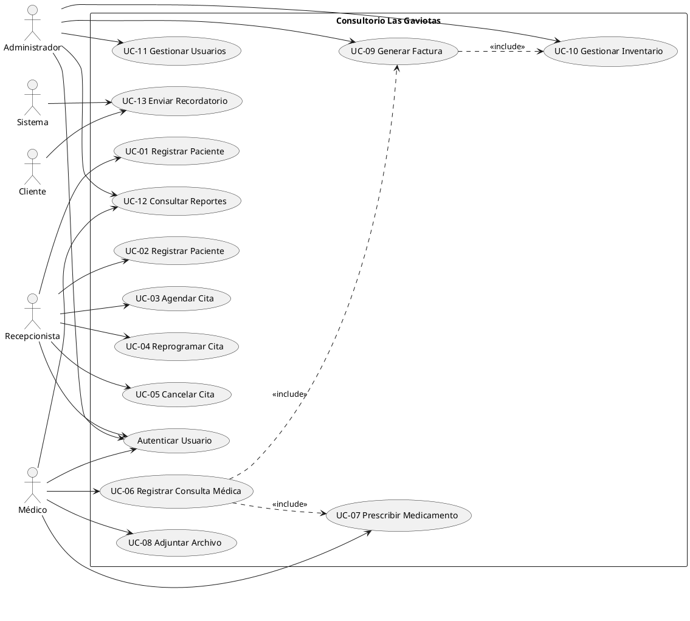
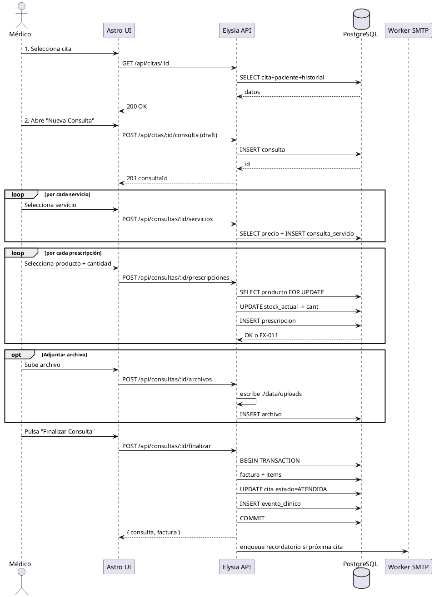
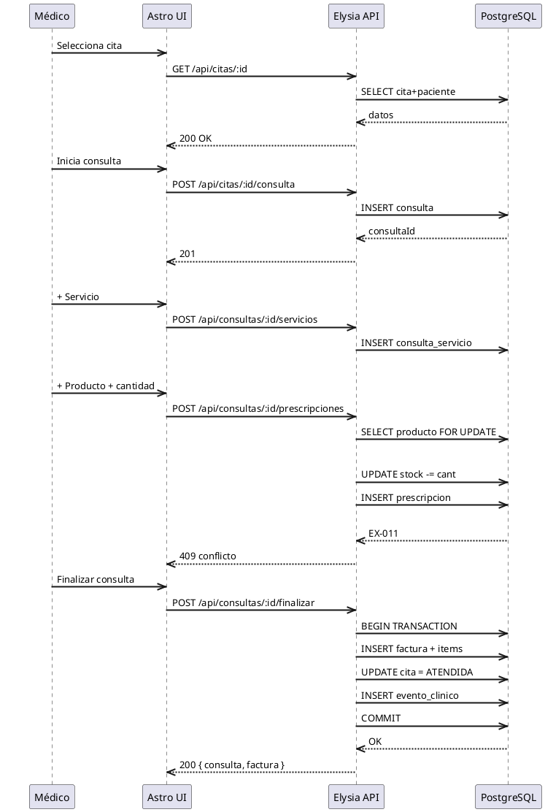

# Modelo de Casos de Uso - Consultorio Las Gaviotas

**Fase:** Elaboración (RUP)
**Notación principal:** PlantUML
**Apéndice visual:** Mermaid flowchart

**Actores:**
- **Recepcionista** (rol Recepción)
- **Médico** (rol MEDICO)
- **Administrador** (rol Admin)
- **Cliente** (actor secundario, recibe notificaciones)
- **Sistema** (actor automático: worker de recordatorios, reloj de tiempo)

---

## Diagrama General



---

## Caso de Uso Crítico: **UC-06 Registrar Consulta Médica**

Este es el caso más complejo por su interacción con prescripción, inventario, facturación y archivos. Se documenta con nivel de detalle *expandido*.

### Metadatos

| Campo | Valor |
|---|---|
| ID | UC-06 |
| Nombre | Registrar Consulta Médica |
| Actor primario | Médico |
| Precondiciones | Médico autenticado; cita seleccionada en estado `CONFIRMADA` o `EN_CURSO` |
| Postcondiciones | Consulta registrada con diagnóstico, prescripciones (si aplica) y factura emitida |
| Frecuencia estimada | 8-15 veces al día |
| Criticidad | Alta |

### Flujo Principal (Éxito)

| Paso | Actor | Acción |
|---|---|---|
| 1 | Médico | Selecciona la cita del día desde el panel de citas programadas |
| 2 | Sistema | Muestra datos de la cita + paciente + historial clínico resumido |
| 3 | Médico | Abre el formulario "Nueva Consulta" |
| 4 | Sistema | Despliega campos: síntomas, diagnóstico, tratamiento, observaciones |
| 5 | Médico | Ingresa síntomas observados |
| 6 | Médico | Ingresa diagnóstico |
| 7 | Médico | Selecciona servicios realizados (ej. consulta general + aplicación de vacuna) |
| 8 | Sistema | Registra cada servicio con su precio vigente y lo acumula en pre-factura |
| 9 | Médico | Opcional: agrega prescripción de uno o varios productos desde inventario |
| 10 | Sistema | Para cada producto: valida stock, descuenta cantidad y suma al acumulado de pre-factura |
| 11 | Médico | Opcional: adjunta archivos (imágenes, resultados de laboratorio) |
| 12 | Sistema | Almacena archivos en volumen y registra metadatos |
| 13 | Médico | Pulsa "Finalizar Consulta" |
| 14 | Sistema | Abre transacción SQL, persiste consulta + prescripciones + factura + items |
| 15 | Sistema | Genera número de factura correlativo, muestra resumen al médico |
| 16 | Sistema | Cambia el estado de la cita a `ATENDIDA` y de la factura a `EMITIDA` |
| 17 | Sistema | Registra entradas en el historial clínico de la paciente |

### Diagrama de Secuencia



### Diagrama de Secuencia



### Flujos Alternativos

**A1 - Stock insuficiente (paso 10):**
- 10a. Sistema detecta que el stock del producto es menor a la cantidad solicitada.
- 10b. Muestra alerta indicando: producto, stock disponible, cantidad solicitada.
- 10c. Médico decide: (i) ajustar cantidad al stock disponible, (ii) seleccionar otro producto, (iii) posponer prescripción.
- 10d. Si acepta (i), continúa con la cantidad ajustada.

**A2 - Cancelar consulta en curso (paso 13):**
- 13a. Médico pulsa "Cancelar".
- 13b. Sistema requiere confirmación.
- 13c. Si confirma: cita queda en estado `NO_ATENDIDA`, no se genera factura, se libera inventario (rollback), se registra motivo en bitácora.

**A3 - Error al adjuntar archivo (paso 11):**
- 11a. Sistema falla al guardar el archivo (disco lleno, permisos).
- 11b. Muestra mensaje de error específico del catálogo de excepciones.
- 11c. Médico puede reintentar o continuar sin el archivo (consulta no se bloquea).

### Reglas de Negocio

| Código | Regla |
|---|---|
| RN-01 | Una cita solo puede generar una consulta |
| RN-02 | Una consulta puede registrar N prescripciones, pero cada prescripción referencia exactamente un producto |
| RN-03 | El descuento de inventario debe ser atómico (transacción); si falla algo, se hace rollback completo |
| RN-04 | La factura no se puede eliminar una vez emitida; solo anular (requiere rol Administrador) |
| RN-05 | El historial clínico de la paciente se actualiza de forma automática al cerrar la consulta |
| RN-06 | El número de factura es correlativo y único por clínica, sin reinicios |
| RN-07 | La sesión del médico debe estar activa para acceder al flujo |

### Casos de Uso Incluidos / Extendidos

- `<<include>>` UC-07 Prescribir Medicamento (paso 9-10)
- `<<include>>` UC-08 Adjuntar Archivo (paso 11)
- `<<include>>` UC-09 Generar Factura (paso 14-16)
- `<<extend>>` A1 Stock Insuficiente (paso 10)

### Especificación de Interfaces (extracto para Elysia)

```
POST   /api/citas/:id/consulta
       Body: { sintomas, diagnostico, tratamiento, observaciones }
       Roles: médico
       Crea consulta en estado "borrador" vinculada a la cita

POST   /api/consultas/:id/prescripciones
       Body: { productoId, cantidad, dosis, frecuencia, duracion }
       Roles: médico
       Descuenta stock atómicamente y suma al acumulado

POST   /api/consultas/:id/servicios
       Body: { servicioId, cantidad }
       Roles: médico
       Registra servicio en consulta con precio vigente

POST   /api/consultas/:id/archivos
       Body: multipart/form-data
       Roles: médico
       Almacena archivo en ./data/uploads y registra metadatos

POST   /api/consultas/:id/finalizar
       Roles: médico
       Cierra transacción: persiste consulta, prescripciones, factura, items, actualiza historial
       Respuesta: { consulta, factura, items }
```
