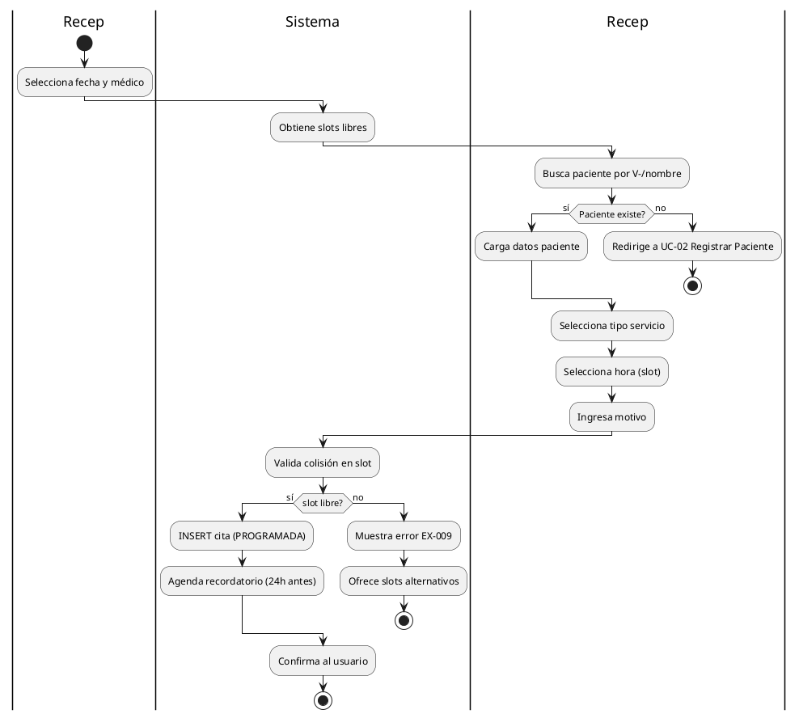
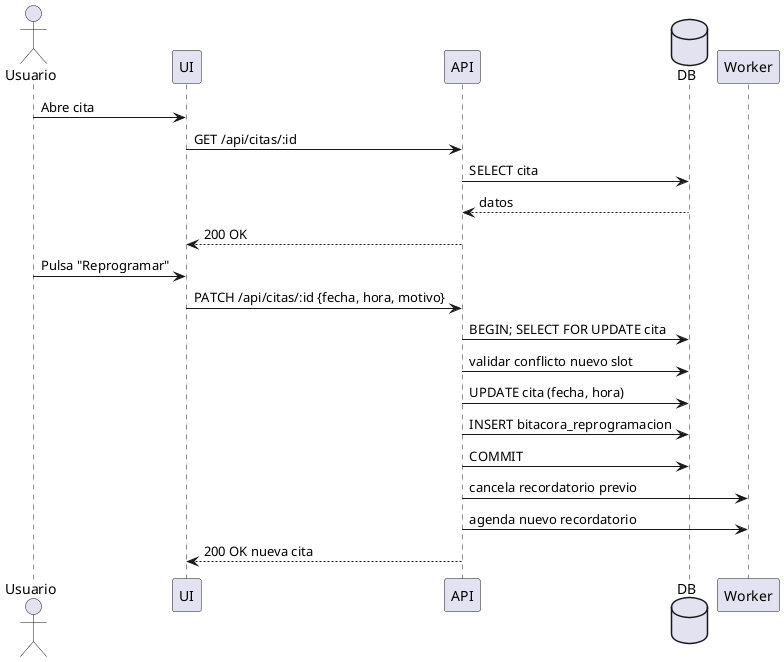
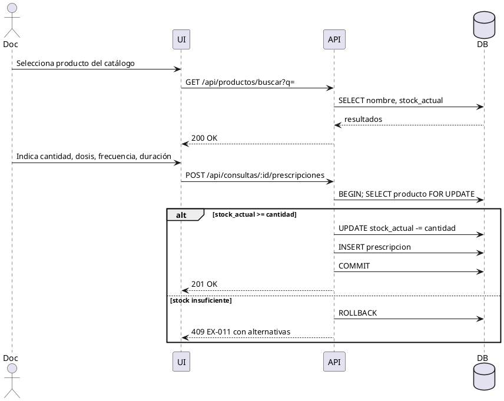

# Casos de Uso Expandidos - Consultorio Las Gaviotas

**Fase:** Elaboración
**Complemento de:** `02-casos-uso.md`
**Notación:** PlantUML (principal) + Mermaid

Este documento amplía los casos de uso críticos al mismo nivel de detalle que UC-06. Cada uno cubre flujo principal, alternativos y reglas de negocio.

---

## UC-03 Agendar Cita

### Metadatos

| Campo | Valor |
|---|---|
| Actor primario | Recepción (Recepcionista) |
| Precondición | Paciente registrada y activo en el sistema |
| Postcondición | Cita creada en estado `PROGRAMADA` con slot reservado |
| Criticidad | Alta - entrada del flujo diario |

### Flujo Principal

| Paso | Actor | Acción |
|---|---|---|
| 1 | Recepción | Selecciona fecha y médico |
| 2 | Sistema | Muestra slots disponibles (sin colisión) |
| 3 | Recepción | Selecciona paciente (búsqueda por V-/nombre) |
| 4 | Sistema | Muestra historial mínimo: sexo, edad, alertas (ej. vacunas vencidas) |
| 5 | Recepción | Elige tipo de servicio (consulta/vacuna/cirugía/control) |
| 6 | Recepción | Elige hora (slot) dentro de disponibilidad |
| 7 | Recepción | Ingresa motivo de visita |
| 8 | Sistema | Valida conflicto (uq_cita_slot_medico) |
| 9 | Sistema | Persiste cita en estado `PROGRAMADA` |
| 10 | Sistema | Agenda recordatorio 24h antes (worker) |
| 11 | Sistema | Confirma al usuario y muestra resumen |

### Diagrama de Actividad

## Reglas

| Código | Regla |
|---|---|
| RN-08 | Un slot no puede tener dos citas del mismo médico simultáneamente |
| RN-09 | Toda cita requiere motivo (mínimo 5 caracteres) |
| RN-10 | Citas en estado CANCELADA o NO_ASISTIO se mantienen por auditoría, no se eliminan |

---

## UC-04 Reprogramar Cita

### Metadatos

| Campo | Valor |
|---|---|
| Actor primario | Recepción o Médico |
| Precondición | Cita en estado `PROGRAMADA`, `CONFIRMADA` o `EN_CURSO` |
| Postcondición | Cita con nueva fecha/hora y registro de cambio en historial |

### Flujo Principal

| Paso | Acción |
|---|---|
| 1 | Usuario abre cita existente |
| 2 | Pulsa "Reprogramar" |
| 3 | Sistema ofrece nuevo calendario |
| 4 | Usuario elige nueva fecha/hora y motivo de reprogramación |
| 5 | Sistema valida disponibilidad y conflictos |
| 6 | Sistema actualiza cita y registra evento en bitácora |
| 7 | Sistema cancela recordatorio previo y agenda nuevo |

### Diagrama de Secuencia

---

## UC-05 Cancelar Cita

### Metadatos

| Campo | Valor |
|---|---|
| Actor primario | Recepción |
| Precondición | Cita no atendida |
| Postcondición | Cita en estado `CANCELADA`; recordatorio cancelado |

### Flujo Principal

| Paso | Acción |
|---|---|
| 1 | Usuario selecciona cita |
| 2 | Pulsa "Cancelar" |
| 3 | Sistema exige confirmación + motivo |
| 4 | Sistema actualiza estado a `CANCELADA` |
| 5 | Sistema cancela notificaciones pendientes |
| 6 | Sistema registra evento |

### Regla

- RN-11: citas en estado `ATENDIDA` no se pueden cancelar (EX-010).

---

## UC-07 Prescribir Medicamento

(Complemento al flujo principal de UC-06)

### Secuencia

---

## UC-09 Generar Factura (automático al cerrar consulta)

Ver `prototype/consulta-flow.ts` para la lógica transaccional. La factura se crea dentro del `BEGIN/COMMIT` al finalizar consulta.

### Elementos incluidos automáticamente

- **Servicios**: cada `consulta_servicio` con su `precio_cobrado` congelado.
- **Productos**: cada `prescripcion` con `precio_unitario_cobrado` congelado.
- **Subtotal**: suma de servicios + productos.
- **Impuestos**: `subtotal * TAX_RATE` (configurable por clínica).
- **Total**: `subtotal + impuestos`.
- **Número**: `F-{año}-{secuencia}` desde `factura_numero_seq`.
- **Estado inicial**: `EMITIDA`.

### Acciones posteriores posibles

- Pagar factura (rol Recepción) → estado `PAGADA`.
- Anular factura (rol Administrador) → estado `ANULADA`, requiere motivo en bitácora.
