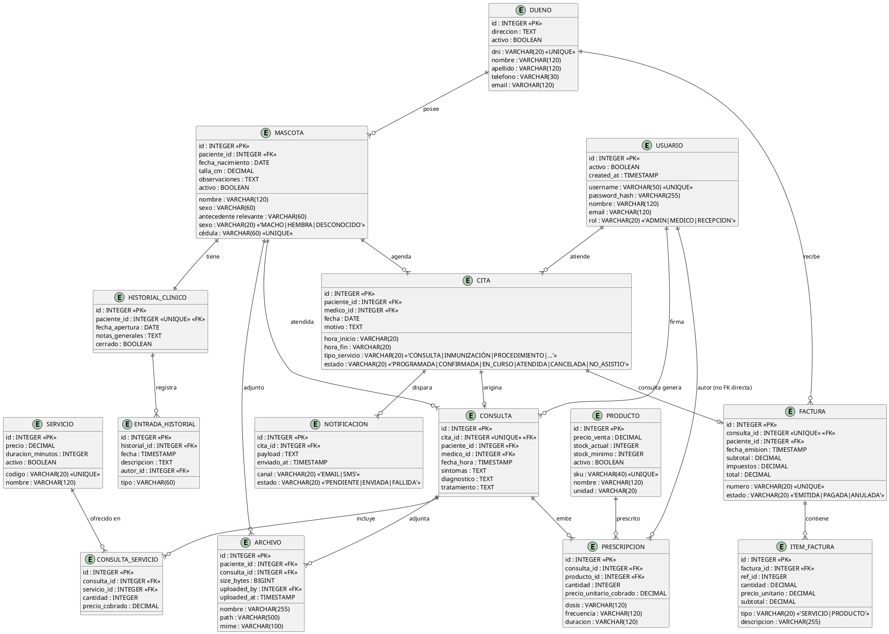

# Diagrama ER (Modelo Físico) - Consultorio Las Gaviotas

**Fase:** Elaboración
**Generado desde:** `db/migrations/0001_init.sql`
**Notación:** Mermaid `erDiagram`
**Propósito:** Vista rápida para el profesor sin abrir herramienta UML.

---

---

## Índices relevantes

| Tabla | Índice | Finalidad |
|---|---|---|
| cita | `uq_cita_slot_medico` | Evita doble reserva por médico en mismo slot |
| producto | `ix_producto_stock_bajo` | Alertas de stock mínimo |
| consulta | `ix_consulta_paciente` | Vista historial clínico por paciente |
| factura | `ix_factura_paciente` | Reportes por cliente |
| item_factura | `ix_item_factura_factura` | Detalle de factura rápido |
| notificacion | `ix_notificacion_estado_envio` | Cola de envío del worker |
