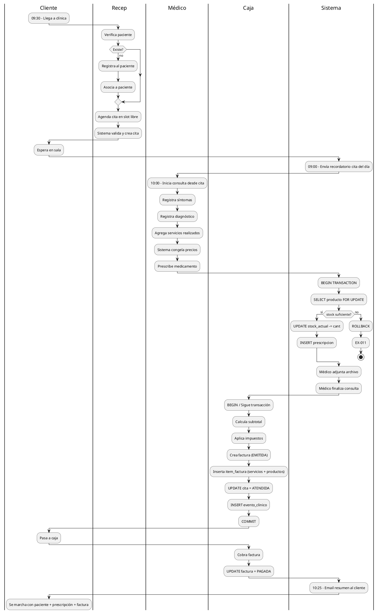
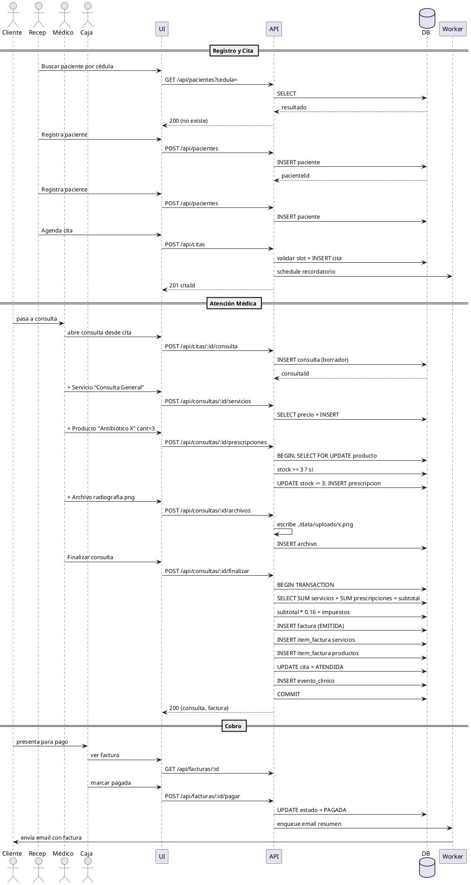

# Flujo Completo "Día en la Clínica" - Consultorio Las Gaviotas

**Fase:** Elaboración (modelo) → Transición (ejecución demo)
**Propósito:** Diagrama end-to-end del escenario que se demostrará al profesor.
**Notación:** PlantUML

Este flujo cubre el ciclo completo desde que un cliente llega a la clínica hasta que paga y se marcha, pasando por los tres roles del sistema.

---

## Actores participantes en el escenario

- **Paciente)
- **Recepción** (operador de mostrador)
- **Médico** (atiende consulta)
- **Caja** (rol Recepción con permisos de cobro)
- **Sistema** (worker de recordatorios)

---

## Flujo Narrativo

| # | Hora | Quien | Qué pasa |
|---|---|---|---|
| 1 | 09:00 | Sistema | Envía recordatorio automático de cita del día |
| 2 | 09:30 | Paciente Luna (sin cita previa) |
| 3 | 09:30 | Recepción | Verifica si Luna está registrada; no, la registra + al paciente |
| 4 | 09:35 | Recepción | Agenda cita en slot libre con Dr. Carlos Pérez |
| 5 | 09:50 | Recepción | Confirma cita, sistema agenda recordatorio |
| 6 | 10:00 | Médico | Atiende a Luna, abre consulta desde cita |
| 7 | 10:05 | Médico | Registra síntomas y diagnóstico |
| 8 | 10:10 | Médico | Selecciona servicio "Consulta general" |
| 9 | 10:12 | Médico | Prescribe medicamento X (3 unidades, 5 días) |
| 10 | 10:13 | Sistema | Descuenta stock atómicamente, valida sin faltantes |
| 11 | 10:14 | Médico | Adjunta imagen de radiografía |
| 12 | 10:15 | Médico | Pulsa "Finalizar consulta" |
| 13 | 10:15 | Sistema | Persiste consulta, factura EMITIDA, historial actualizado |
| 14 | 10:20 | Cliente | Pasa a caja a pagar |
| 15 | 10:20 | Caja | Cobra factura, marca como PAGADA |
| 16 | 10:25 | Paciente, prescripción y factura |
| 17 | 10:25 | Sistema | Notifica al cliente email con resumen |
| 18 | fin día | Admin | Consulta reporte diario de atenciones |

---

## Diagrama de Actividad General

---

## Diagrama de Secuencia Completo

---

## Puntos críticos cubiertos (mapeo a reglas de negocio)

| RN | Punto en el flujo |
|---|---|
| RN-01 | Una cita solo origina una consulta (transacción de `Finalizar`) |
| RN-02 | N prescripciones por consulta, una por producto |
| RN-03 | Stock descontado dentro de BEGIN/COMMIT |
| RN-04 | Factura no se elimina, se anula (no aplica aquí porque es flujo feliz) |
| RN-05 | Historial clínico actualizado automáticamente |
| RN-06 | Número de factura correlativo vía `factura_numero_seq` |
| RN-07 | Sesión activa exigida en cada request (validado por middleware JWT) |
| RN-08 | Validación de slot único (uq_cita_slot_medico) |
| RN-09 | Motivo oblirio al agendar |
| RN-11 | No se cancelan citas ATENDIDAS |

---

## Variantes a demostrar en la presentación

| Variante                    | Cómo se demuestra                                                 |
| --------------------------- | ----------------------------------------------------------------- |
| **Cliente con cita previa** | Saltar al paso de Atención, omitir Registro                       |
| **Cancelación**             | Mostrar UC-05 antes de atención                                   |
| **Stock bajo**              | Provocar EX-011 mostrando mensaje al médico                  |
| **Reprogramación**          | Cliente llama para cambiar hora, Recep usa UC-04                  |
| **Anulación factura**       | Admin corrige cobro, factura pasa a ANULADA con nuevo comprobante |
