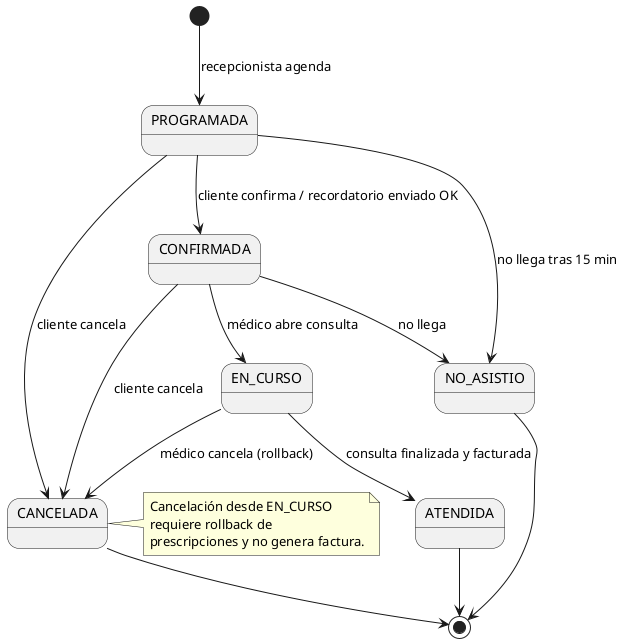
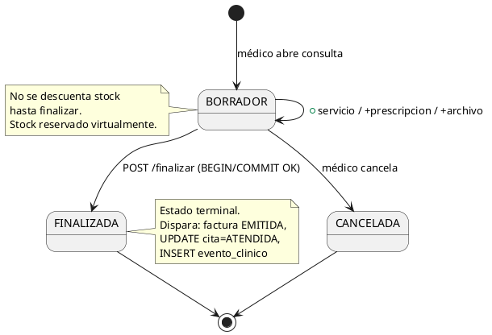
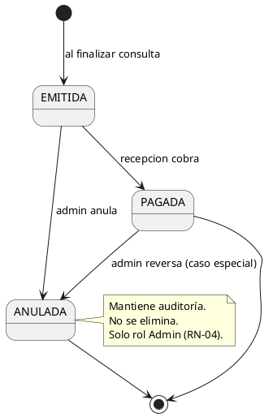
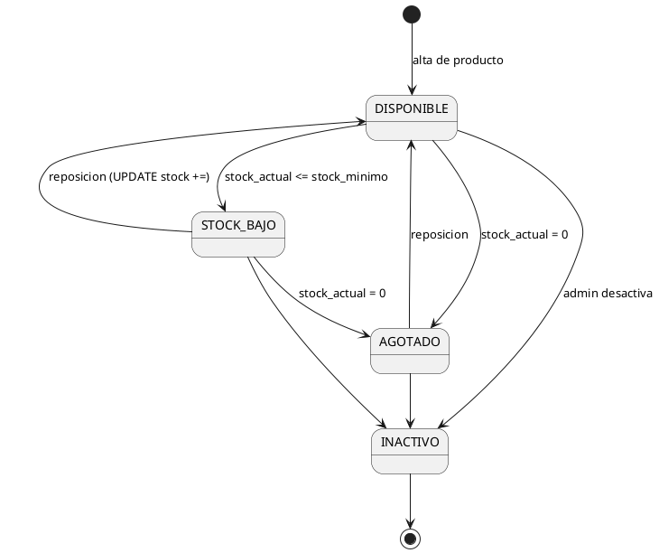
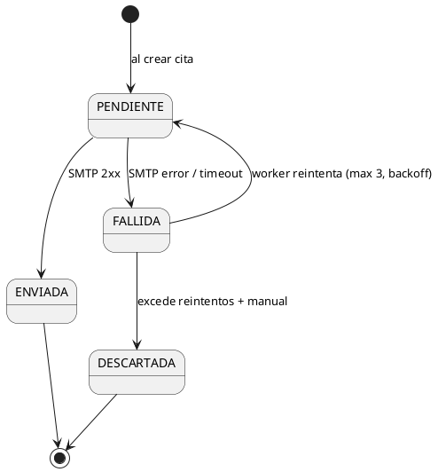

# Máquinas de Estado - Consultorio Las Gaviotas

**Fase:** Elaboración
**Propósito:** Documentar el ciclo de vida de las entidades con estados explícitos.
**Notación:** PlantUML

---

## Estados de `Cita`

**Transiciones válidas (tabla):**

| Origen | Destino | Disparador | Actor |
|---|---|---|---|
| (ninguno) | PROGRAMADA | INSERT inicial | Recepción |
| PROGRAMADA | CONFIRMADA | Sistema (recordatorio enviado OK) o Recepción manual | Sistema / Recepción |
| PROGRAMADA | CANCELADA | Cancelación | Recepción / Cliente |
| PROGRAMADA | NO_ASISTIO | Tarea programada (15 min post slot) | Sistema |
| CONFIRMADA | EN_CURSO | Médico abre consulta | Médico |
| CONFIRMADA | CANCELADA | Cancelación | Recepción / Cliente |
| CONFIRMADA | NO_ASISTIO | Tarea programada | Sistema |
| EN_CURSO | ATENDIDA | `POST /finalizar` exitoso | Médico |
| EN_CURSO | CANCELADA | Botón "cancelar consulta" con confirmación | Médico |

---

## Estados de `Consulta`

---

## Estados de `Factura`

---

## Estados de `Producto` (stock)

---

## Estados de `Notificacion`

