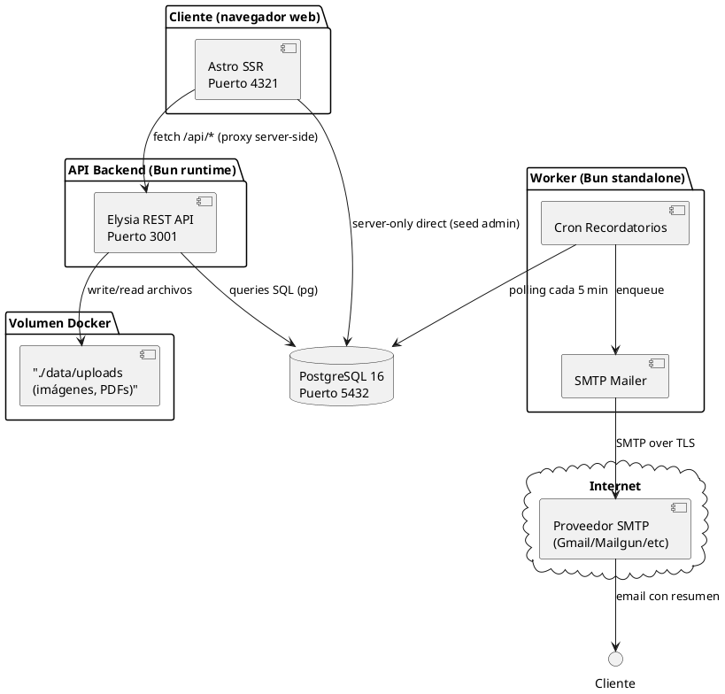
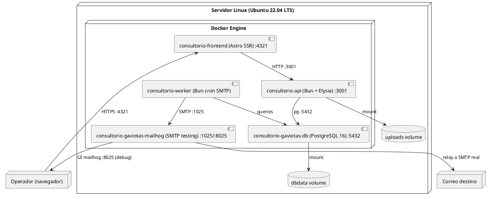

# Arquitectura, Componentes y Despliegue - Consultorio Las Gaviotas

**Fase:** Elaboración (diseño) → Transición (implantación)
**Notación:** PlantUML

---

## Diagrama de Componentes



---

## Diagrama de Despliegue



---

## Mapa de Contenedores (docker-compose)

```yaml
# deploy/docker-compose.yml (resumen)
services:
  frontend:
    image: consultorio-frontend
    build: ../apps/frontend
    ports: ["4321:4321"]
    depends_on: [api]
    environment:
      - PUBLIC_API_URL=http://api:3001

  api:
    image: consultorio-api
    build: ../apps/backend
    ports: ["3001:3001"]
    depends_on: [db]
    environment:
      - DATABASE_URL=postgres://consultorio-gaviotas:***@db:5432/consultorio-gaviotas
      - JWT_SECRET=${JWT_SECRET}
      - UPLOAD_DIR=/data/uploads

  worker:
    image: consultorio-worker
    build: ../apps/worker
    depends_on: [db, mailhog]
    environment:
      - DATABASE_URL=postgres://consultorio-gaviotas:***@db:5432/consultorio-gaviotas
      - SMTP_HOST=mailhog
      - SMTP_PORT=1025

  db:
    image: postgres:16-alpine
    ports: ["5432:5432"]
    volumes:
      - dbdata:/var/lib/postgresql/data
      - ./db/migrations:/docker-entrypoint-initdb.d
    environment:
      - POSTGRES_USER=consultorio-gaviotas
      - POSTGRES_PASSWORD=***
      - POSTGRES_DB=consultorio-gaviotas

  mailhog:
    image: mailhog/mailhog
    ports: ["1025:1025", "8025:8025"]

volumes:
  dbdata:
  uploads:
```

---

## Red y volúmenes

| Recurso | Tipo | Persistencia | Backup |
|---|---|---|---|
| `dbdata` | Volumen Docker | Sí (sobrevive reinicios) | Dump diario + rsync |
| `uploads` | Bind mount `./data/uploads` | Sí (carpeta host) | rsync diario |
| Red `consultorio-gaviotas-net` | Bridge interna | Servicio a servicio | N/A |

---

## Tamaño de contenedores (estimado)

| Contenedor | Imagen base | RAM estimada | CPU |
|---|---|---|---|
| frontend | node:22-alpine + Astro | 150 MB | 0.25 |
| api | oven/bun:alpine | 200 MB | 0.5 |
| worker | oven/bun:alpine | 100 MB | 0.2 |
| db | postgres:16-alpine | 256 MB | 0.5 |
| mailhog | mailhog/mailhog | 50 MB | 0.1 |

Total estimado: ~750 MB RAM, holgura amplia en servidor 4 GB.