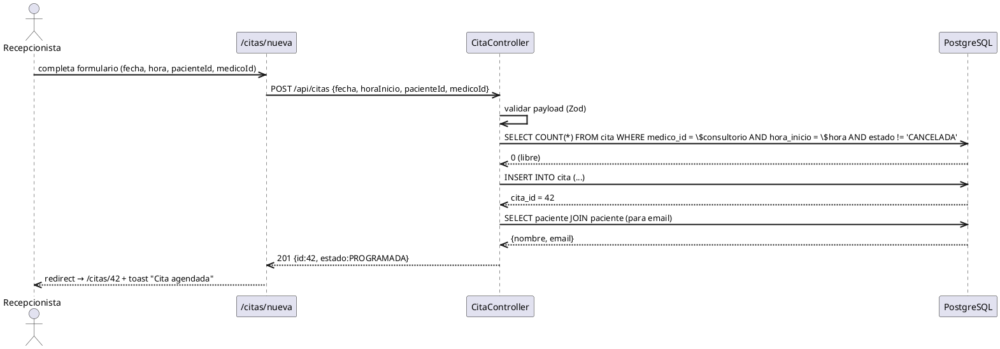
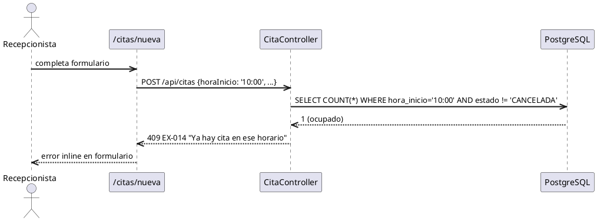
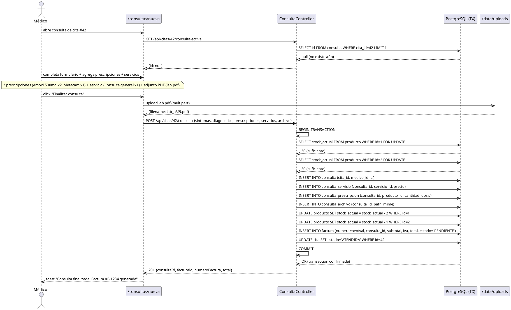
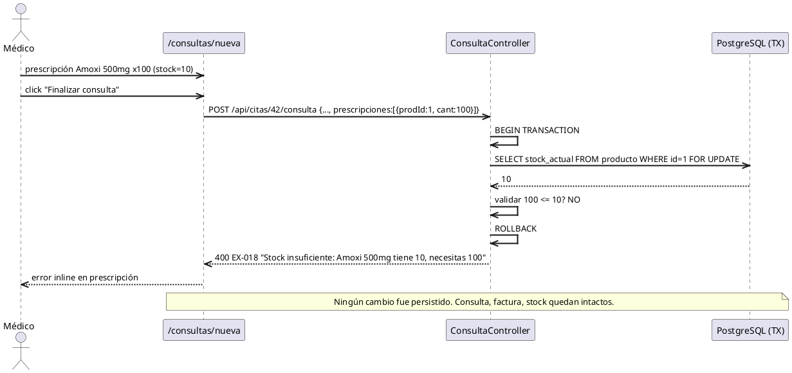
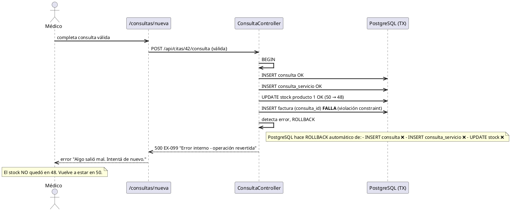
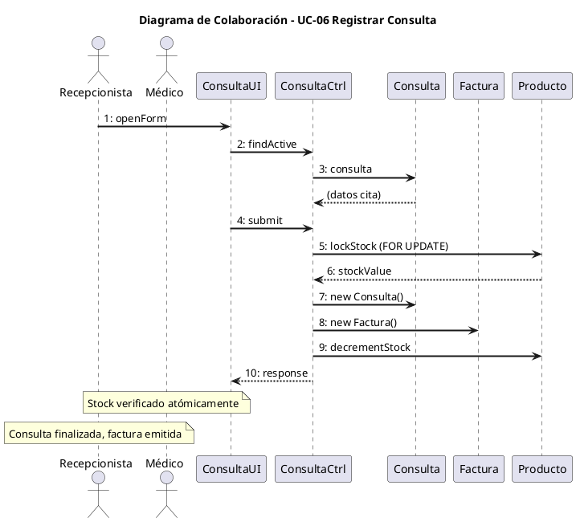
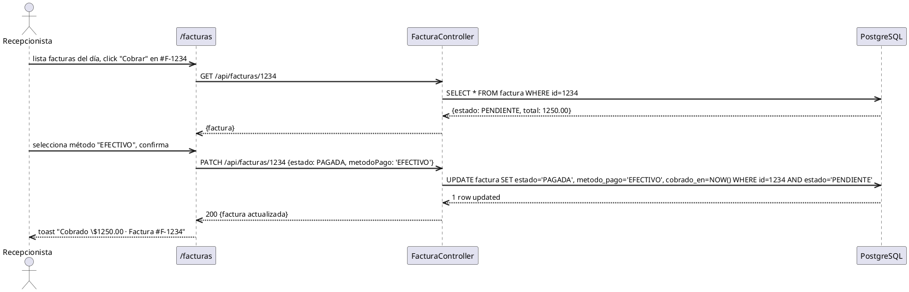
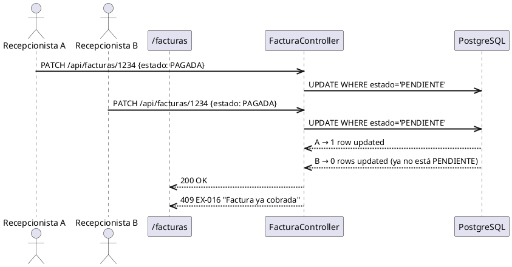
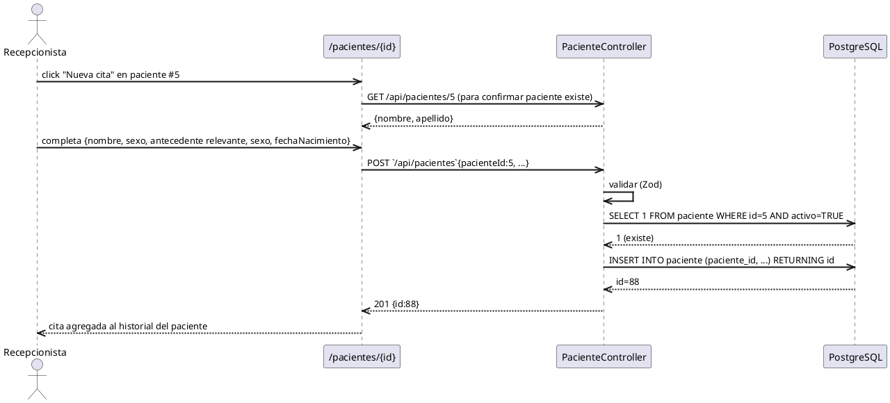
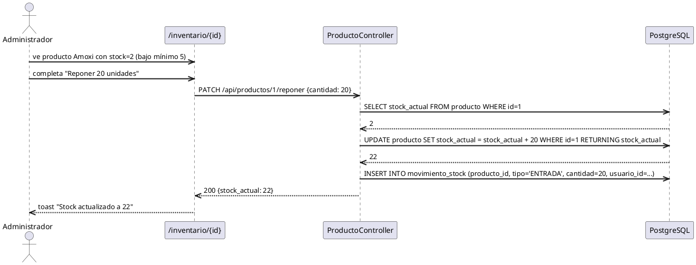

# Diseño DSI - Realización de Casos de Uso

**Fase:** Elaboración (RUP)
**Tipo:** Diseño del Sistema de Información (DSI)
**Propósito:** Documentar la interacción entre objetos del sistema para los casos de uso críticos.

Cada caso se modela con un **diagrama de secuencia** que muestra:
- Actores (Usuario, Sistemas externos)
- Objetos del sistema (boundary, control, entity)
- Mensajes en orden temporal
- Decisiones, alternativas y excepciones

---

## UC-03: Agendar Cita Médica

### Realización - Camino feliz

### Realización - Alternativa: conflicto de horario

---

## UC-06: Registrar Consulta Médica (CRÍTICO)

Este es el caso de uso más importante del sistema. Demuestra la **atomicidad transaccional** que es la propuesta de valor única de Consultorio Las Gaviotas.

### Realización - Camino feliz

### Realización - Excepción: stock insuficiente

### Realización - Excepción: falla de BD durante transacción

### Diagrama de colaboración (objetos)

---

## UC-09: Cobrar Factura

### Realización - Camino feliz

### Realización - Excepción: doble cobro (race condition)

---

## UC-04: Registrar Paciente

---

## UC-07: Reponer Stock

---

## Patrones arquitectónicos identificados

De la realización de estos CU emergen 3 patrones:

### Transaction Script con Control Explícito
Cada endpoint crítico encapsula una transacción BEGIN/COMMIT con ROLLBACK ante cualquier excepción. La lógica de negocio vive en el handler, no en la DB (excepto constraints NOT NULL/UNIQUE/FK).

### Optimistic Locking via WHERE en UPDATE
Para evitar race conditions en transiciones de estado (cobrar factura, cancelar cita), el UPDATE incluye `WHERE estado = 'ESPERADO'` y se chequea el rowcount. Si 0, retorna 409.

### Pessimistic Locking con FOR UPDATE
Para decremento de stock en consulta médica, se hace `SELECT ... FOR UPDATE` antes del UPDATE para serializar accesos concurrentes a la misma fila.

---

## Mapeo a código

| CU | Endpoint | Archivo |
|---|---|---|
| UC-03 | `POST /api/citas` | `apps/backend/src/modules/citas/cita.routes.ts` |
| UC-04 | `POST `/api/pacientes` | `apps/backend/src/modules/pacientes/paciente.routes.ts` |
| UC-06 | `POST /api/citas/:id/consulta` | `apps/backend/src/modules/consultas/consulta.routes.ts` |
| UC-07 | `PATCH /api/productos/:id/reponer` | `apps/backend/src/modules/productos/producto.routes.ts` |
| UC-09 | `PATCH /api/facturas/:id` | `apps/backend/src/modules/facturas/factura.routes.ts` |

El prototipo arquitectónico de UC-06 está implementado en `apps/backend/src/prototype/consulta-flow.ts` y demuestra la transacción atómica end-to-end.