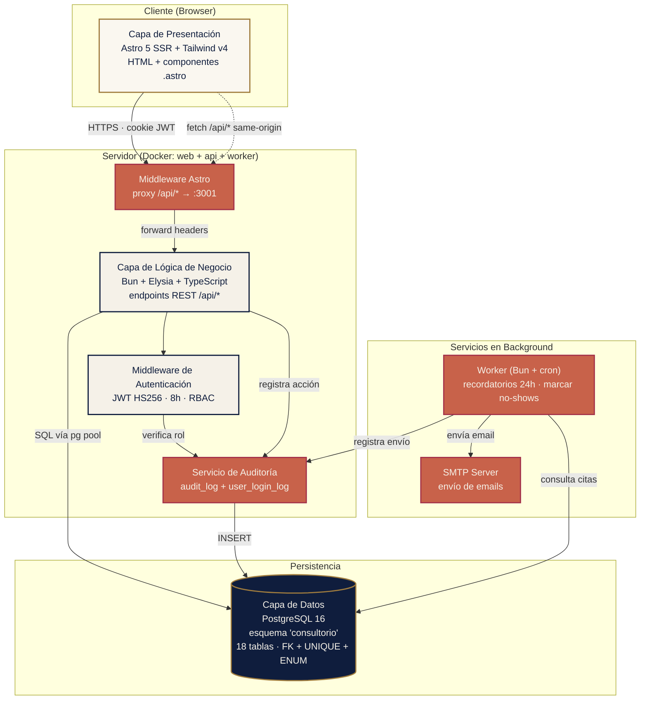
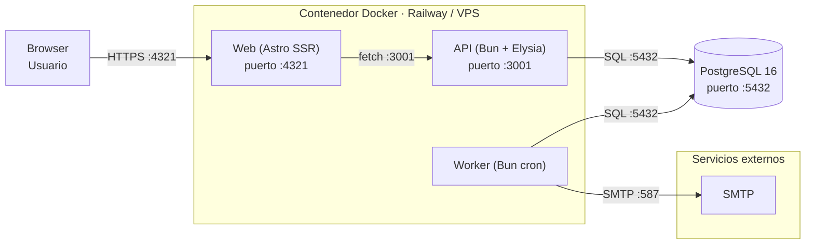

# Diagrama de Capas — Consultorio Las Gaviotas

**Versión:** 1.0
**Estado:** Aprobado · Fase de Elaboración (RUP)
**Producto:** Sistema de Información Automatizado para la Gestión de Registro y Orden de Pacientes en C.A Consultorio Médico Las Gaviotas

---

## 1. Propósito

El **Diagrama de Capas** muestra la separación arquitectónica entre las capas lógicas del sistema:

- **Capa de Presentación** — UI que ve el usuario.
- **Capa de Lógica de Negocio** — reglas, validaciones, orquestación.
- **Capa de Persistencia** — acceso a datos (PostgreSQL).
- **Capa de Infraestructura** — servicios cross-cutting (auth, mail, logs).

Esta separación es la que justifica la elección de arquitectura (Astro SSR + Elysia + PostgreSQL con proxy `/api/*`).

---

## 2. Diagrama de capas



---

## 3. Descripción por capa

### Capa 1 — Presentación (Frontend)

**Tecnología:** Astro 5 SSR + Tailwind v4 + tipografía concierge médico premium (Spectral + Manrope + JetBrains Mono).

**Responsabilidad:** renderizar HTML server-side con datos del backend, manejar sesión del usuario vía cookie HttpOnly con JWT.

**Rutas:**
- `/login`, `/logout` (públicas)
- `/dashboard`, `/pacientes/**`, `/citas/**`, `/consultas/**`, `/facturas/**`, `/inventario/**`, `/servicios/**`, `/reportes/**`, `/usuarios/**`, `/auditoria/**`, `/mantenimiento/**`

**Patrones:**
- SSR con Node adapter → el HTML se genera en servidor, JS mínimo.
- Middleware Astro (`middleware.ts`) que actúa como proxy: `/api/*` → `http://localhost:3001/api/*`.
- Cookie `consultorio_token` HttpOnly + SameSite=Lax para el JWT.

### Capa 2 — Lógica de Negocio (Backend API)

**Tecnología:** Bun 1.3 + Elysia 1 + TypeScript + Zod.

**Responsabilidad:** implementar las reglas de negocio, validar datos con Zod, autorizar por rol (RBAC), coordinar transacciones ACID.

**Estructura por módulos:**
```
apps/backend/src/modules/
├── auth/          # Login, JWT, sesión
├── pacientes/     # CRUD + búsqueda + auditoría
├── citas/         # Agendar, reprogramar, cancelar
├── consultas/     # Abrir consulta, síntomas, cerrar
├── facturas/      # Generar, cobrar, anular
├── productos/     # CRUD + alertas stock bajo
├── servicios/     # Catálogo de prestaciones
├── usuarios/      # CRUD de cuentas + roles
├── audit/         # GET /api/audit/logs · stats
├── mantenimiento/ # POST backup · restore
└── reportes/      # 3 PDFs con wkhtmltopdf
```

**Patrones:**
- Validación de entrada con Zod en cada endpoint.
- Middleware de auth: extrae JWT del header, decodifica, expone `x-user`.
- `withTransaction` para operaciones multi-query (consulta + factura + stock).
- `recordAudit` automático en cada operación de escritura.

### Capa 3 — Persistencia (Base de Datos)

**Tecnología:** PostgreSQL 16 + driver `pg` (Node).

**Responsabilidad:** almacenar datos con integridad referencial, transacciones ACID, consultas eficientes vía índices.

**Esquema:** `consultorio` con 18 tablas (ver `docs/fase-elaboracion/03-er-diagrama.md`):
- `usuario`, `paciente`, `cita`, `consulta`, `historial_clinico`, `entrada_historial`
- `servicio`, `producto`, `prescripcion`, `consulta_servicio`
- `factura`, `item_factura`
- `archivo`, `notificacion`
- `audit_log`, `user_login_log`

**Pool:** 10 conexiones simultáneas (`pg.Pool`).

**Garantías:**
- ACID en cada transacción.
- FK + UNIQUE + CHECK en todas las relaciones críticas.
- ENUM para estados (rol_usuario, estado_cita, estado_factura, etc.).
- Índices en todas las FK y campos consultados (`cedula`, `apellido_nombre`, `fecha`).

### Capa 4 — Infraestructura (Cross-cutting)

**Tecnología:** servicios heterogéneos, orquestados por Docker Compose o Railway.

**Servicios:**

| Servicio | Función | Tecnología |
|---|---|---|
| Proxy /api/* | Redirige el tráfico del navegador al backend interno | Astro middleware |
| Middleware JWT | Verifica token y rol en cada request | Elysia `onBeforeHandle` |
| Audit Service | Registra cada operación en `audit_log` | `lib/audit.ts` |
| Worker | Cron cada 60s: recordatorios 24h + marcar no-shows | Bun + `setInterval` |
| SMTP | Envío de emails (MailHog local / SendGrid prod) | nodemailer |
| Migraciones | Aplica schema al iniciar | `src/db/migrate.ts` |
| Seed | Puebla datos demo | `src/db/seed.ts` |
| Backups | `pg_dump`/`pg_restore` desde web admin | `mantenimiento.routes.ts` |

---

## 4. Reglas de dependencia

Las dependencias entre capas siguen la regla **estrictamente descendente**:

```
Presentación  →  Lógica  →  Persistencia
                  ↓
              Infraestructura (transversal)
```

**Reglas:**

1. **Presentación NO accede directo a Persistencia.** Todo va por la API.
2. **Lógica NO es accedida por Infraestructura** (excepto el middleware de auth, que es transversal).
3. **Persistencia NO conoce a Lógica ni Presentación.** Es solo storage.
4. **Infraestructura es transversal** — los servicios de auth, audit, worker pueden operar sobre cualquier capa.

**Consecuencia práctica:** si en el futuro se quisiera cambiar PostgreSQL por otra BD, solo la capa de Persistencia se modifica; las capas de arriba no se enteran.

---

## 5. Comparación con otras arquitecturas (descartadas)

| Alternativa | Por qué se descartó |
|---|---|
| **Monolito PHP** (WordPress + plugins) | Acoplamiento fuerte, difícil de versionar, RBAC limitado. |
| **SPA + backend Java/Spring** | Overhead innecesario para una clínica de 1 médico; equipo sin experiencia en JVM. |
| **Microservicios** (un servicio por módulo) | Overhead operacional enorme (7 servicios, 7 deploys) para un sistema de 30 endpoints. |
| **Serverless** (Cloud Functions) | Latencia variable en arranque en frío, vendor lock-in, debugging complejo. |
| **NoSQL** (MongoDB) | El dominio es altamente relacional (paciente ↔ cita ↔ consulta ↔ factura). ACID crítico. |

**Arquitectura elegida:** monolito modular con Bun + Elysia + PostgreSQL, frontend Astro SSR, separado en 3 procesos (web / api / worker) dentro de un contenedor Docker.

---

## 6. Despliegue físico



- **Un solo contenedor** ejecuta los 3 procesos (`start-all.sh`).
- **PostgreSQL** en contenedor separado (volumen persistente).
- **SMTP** externo (MailHog local / SendGrid producción).
- **Proxy externo** (Nginx + certbot) delante del puerto 4321 para HTTPS.

---

## 7. Conclusión

El sistema sigue una arquitectura de **4 capas** con separación clara de responsabilidades:

- **Presentación** — Astro SSR con tipografía concierge médico.
- **Lógica** — Bun + Elysia con módulos cohesivos por dominio.
- **Persistencia** — PostgreSQL con 18 tablas en esquema `consultorio`.
- **Infraestructura** — auth, audit, worker, backups como servicios transversales.

Esta arquitectura es **simple, portable y mantenible**: corre en Railway con un click, en un VPS con `docker compose up`, o en desarrollo local con `bun run dev`. El monolito modular evita la complejidad operacional de microservicios sin sacrificar cohesión.