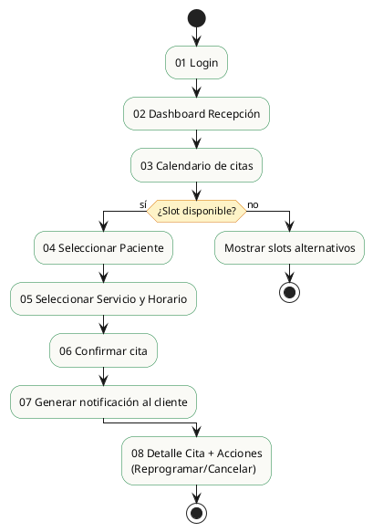

# Prototipo UI - Flujo "Agendar Cita"

**Fase:** Inicio (RUP)
**Objetivo:** Wireframe del flujo completo de programación de citas, desde el ingreso al sistema hasta la confirmación y notificación.
**Herramienta sugerida:** Figma o Balsamiq (prototipo estático, baja fidelidad).
**Restricción:** Solo el flujo de *agendar cita*. No incluir aún consulta, inventario ni facturación.

---

## 1. Mapa de Flujo

---

## 2. Listado de Pantallas

| # | Pantalla | Propósito | Elementos clave |
|---|---|---|---|
| 01 | **Inicio de sesión** | Autenticar al usuario con sus credenciales | Logo Consultorio Las Gaviotas, campos usuario y contraseña, botón "Ingresar", enlace "Recuperar contraseña", mensaje de error si falla |
| 02 | **Dashboard Recepción** | Punto de entrada operativo del recepcionista | Resumen del día (citas agendadas, próximas), accesos rápidos: "Agendar cita", "Buscar paciente", botón de logout, branding superior |
| 03 | **Calendario de citas** | Visualizar disponibilidad y selección de día/hora | Vista semanal/diaria, slots por médico, indicador de ocupación, filtros (tipo de servicio, médico)), botón flotante "+ Nueva cita" |
| 04 | **Nueva Cita - Paso 1: Paciente** | Identificar paciente para la cita | Buscador de pacientes por nombre/cedula/V-, datos del paciente, opción "+ Registrar nuevo paciente", botón "Continuar" |
| 05 | **Nueva Cita - Paso 2: Servicio, Fecha y Hora** | Definir motivo, profesional y horario | Selector de tipo de servicio (consulta / vacuna / cirugía), selector de médico, selector de fecha, slots de hora disponibles (se deshabilitan los ocupados), campo "Motivo de la visita", botón "Agendar" |
| 06 | **Confirmación de cita** | Confirmar datos antes de persistir | Resumen: paciente, fecha, hora, médico, servicio, costo estimado, botones "Confirmar" y "Volver" |
| 07 | **Detalle de cita + Acciones** | Mostrar cita creada y permitir gestión | Datos completos de la cita, estado (Confirmada / Atendida / Cancelada), botones "Reprogramar" y "Cancelar", historial de cambios |
| 08 | **Vista previa de notificación (cliente)** | Simular el correo/SMS que recibe el cliente | Plantilla de email/mensaje con datos de la cita, fecha, hora, médico, dirección de la clínica, botón "Agregar a calendario (.ics)" |

---

## 3. Reglas de Diseño Transversal

- **Roles visibles en navegación superior:** el avatar y nombre del usuario debe mostrar el rol activo (Recepción / Médico / Administrador).
- **Acciones sensibles bloqueadas por rol:** un recepcionista no debe ver botones del módulo Consulta ni Inventario.
- **Mensajería de error consistente:** formato `Icono + Título + Acción sugerida`.
- **Confirmaciones destructivas:** Cancelar cita, eliminar registro, etc., requieren modal de confirmación.
- **Estados vacíos:** cada listado debe mostrar mensaje amigable si no hay datos, nunca tabla vacía silenciosa.

---

## 4. Entregables Esperados para el Profesor

1. Capturas de las 8 pantallas (estática, no navegables).
2. Flujo conectado con flechas indicando transición.
3. Notas al margen indicando: campos oblirios, validaciones, datos cargados automáticamente (no escribir a mano).
4. Paleta de colores y tipografía (opcional pero recomendado para coherencia).

---

## 5. Lo que NO debe aparecer aún en este prototipo

- Pantallas de Consulta Médica (síntomas, diagnóstico, prescripción).
- Pantallas de Inventario (altas, bajas, stock).
- Pantallas de Facturación (emisión, detalle, pagos).
- Reportes o estadísticas.
- Configuración avanzada de la clínica.

Estos módulos se abordarán en iteraciones posteriores (Construcción).
