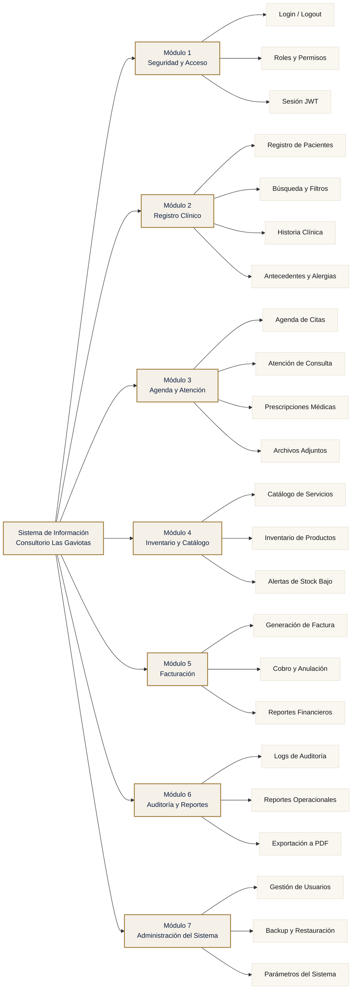
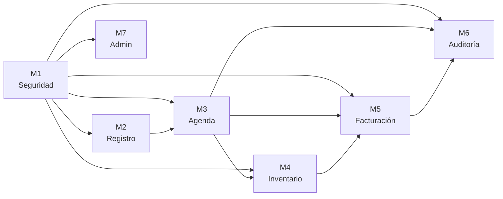

# Modelo de Dominio del Sistema — Consultorio Las Gaviotas

**Versión:** 1.0
**Estado:** Aprobado · Fase de Inicio (RUP)
**Producto:** Sistema de Información Automatizado para la Gestión de Registro y Orden de Pacientes en C.A Consultorio Médico Las Gaviotas

---

## 1. Propósito

El **Modelo de Dominio** describe la descomposición funcional del sistema en módulos y submódulos, estableciendo la frontera entre las áreas del consultorio que el sistema cubre. Es el mapa jerárquico que guía:

- El diseño de navegación (sidebar / nav strip).
- La estructura de URLs y rutas del backend.
- La organización de los equipos de desarrollo en iteraciones.

---

## 2. Diagrama jerárquico

---

## 3. Descripción de cada módulo

### Módulo 1 — Seguridad y Acceso

Controla quién puede usar el sistema y qué puede hacer. Es transversal: todos los demás módulos dependen de él.

| Submódulo | Función | Roles |
|---|---|---|
| Login / Logout | Autenticación con usuario + contraseña, sesión JWT de 8h | Todos |
| Roles y Permisos | Define ADMIN, MEDICO, RECEPCION con permisos granulares | ADMIN gestiona |
| Sesión JWT | Token HS256 con expiración, validado en cada request | Sistema |

**Endpoints REST principales:** `POST /api/auth/login`, `GET /api/auth/me`

---

### Módulo 2 — Registro Clínico

Gestiona la información clínica del paciente (persona atendida). Es la fuente de verdad del sistema.

| Submódulo | Función | Roles |
|---|---|---|
| Registro de Pacientes | Alta de personas con cédula, nombre, fecha nac., contacto | RECEPCION, ADMIN |
| Búsqueda y Filtros | Búsqueda por nombre, apellido, cédula, fecha nac. | Todos |
| Historia Clínica | Apertura automática al registrar, una por paciente | MEDICO, ADMIN |
| Antecedentes y Alergias | Texto libre por paciente, editado por médico | MEDICO, ADMIN |

**Endpoints REST principales:** `GET/POST/PATCH/DELETE /api/pacientes`, `GET /api/pacientes/:id`

---

### Módulo 3 — Agenda y Atención

Gestiona la programación de citas y el acto médico (consulta + prescripción).

| Submódulo | Función | Roles |
|---|---|---|
| Agenda de Citas | Alta, reprogramación, cancelación con validación de slot único | RECEPCION, ADMIN |
| Atención de Consulta | Apertura desde cita, síntomas/diagnóstico/tratamiento | MEDICO, ADMIN |
| Prescripciones Médicas | Medicamentos con dosis, frecuencia, duración | MEDICO |
| Archivos Adjuntos | PDFs de laboratorio, imágenes, subidos a la consulta | MEDICO |

**Endpoints REST principales:** `GET/POST/PATCH /api/citas`, `POST /api/citas/:id/consulta`, `PATCH /api/citas/:id/cancelar`

---

### Módulo 4 — Inventario y Catálogo

Administra el catálogo de prestaciones y el stock de medicamentos/insumos.

| Submódulo | Función | Roles |
|---|---|---|
| Catálogo de Servicios | CRUD de prestaciones (consulta, control, examen, procedimiento) | ADMIN |
| Inventario de Productos | CRUD de productos con stock actual y mínimo | ADMIN |
| Alertas de Stock Bajo | Aviso cuando stock_actual ≤ stock_minimo | Sistema (aut.) + visual |

**Endpoints REST principales:** `GET/POST/PATCH /api/servicios`, `GET/POST/PATCH /api/productos`, `GET /api/productos?bajoStock=true`

---

### Módulo 5 — Facturación

Genera, cobra y anula facturas a partir de las consultas atendidas.

| Submódulo | Función | Roles |
|---|---|---|
| Generación de Factura | Automática al finalizar consulta (número correlativo) | Sistema (aut.) |
| Cobro y Anulación | Marca PAGADA o ANULADA con motivo | RECEPCION, ADMIN |
| Reportes Financieros | Ingresos del día, mes, por médico | ADMIN |

**Endpoints REST principales:** `GET /api/facturas`, `GET /api/facturas/:id`, `POST /api/facturas/:id/pagar`

---

### Módulo 6 — Auditoría y Reportes

Trazabilidad de operaciones y exportación de información.

| Submódulo | Función | Roles |
|---|---|---|
| Logs de Auditoría | Tabla `audit_log` con usuario, acción, tabla, IP, timestamp | ADMIN |
| Reportes Operacionales | Pacientes, citas, consultas con filtros | ADMIN, MEDICO |
| Exportación a PDF | Render con wkhtmltopdf, filtros aplicables | Todos |

**Endpoints REST principales:** `GET /api/audit/logs`, `GET /api/audit/logins`, `GET /api/audit/stats`, `GET /api/reportes/*/pdf`

---

### Módulo 7 — Administración del Sistema

Configuración del sistema, gestión de cuentas y mantenimiento de BD.

| Submódulo | Función | Roles |
|---|---|---|
| Gestión de Usuarios | CRUD de cuentas con roles y reset de contraseña | ADMIN |
| Backup y Restauración | pg_dump / pg_restore con interfaz web | ADMIN |
| Parámetros del Sistema | Tasa de impuesto, datos del consultorio | ADMIN |

**Endpoints REST principales:** `GET/POST/PATCH/DELETE /api/usuarios`, `POST /api/mantenimiento/backup`, `POST /api/mantenimiento/restore`

---

## 4. Mapeo Módulo → Iteración de Construcción

El proyecto se entrega en tres iteraciones siguiendo la lógica de dependencias técnicas:

| Iteración | Módulos incluidos | Entregable |
|---|---|---|
| **Iteración 1** | M1, M2, M3 (parcial: citas) | Pacientes + agenda funcional |
| **Iteración 2** | M3 (consulta), M4, M5 | Consulta médica completa + facturación |
| **Iteración 3** | M6, M7 | Auditoría + reportes + mantenimiento |

Documentación de cada iteración en `docs/fase-construccion/iteracion-*.md`.

---

## 5. Mapeo Módulo → Rutas del Frontend

| Módulo | Rutas principales |
|---|---|
| M1 | `/login`, `/logout` |
| M2 | `/pacientes`, `/pacientes/nuevo`, `/pacientes/:id` |
| M3 | `/citas`, `/citas/nueva`, `/consultas`, `/consultas/:id` |
| M4 | `/inventario`, `/servicios` |
| M5 | `/facturas`, `/facturas/:id` |
| M6 | `/reportes`, `/auditoria` |
| M7 | `/usuarios`, `/mantenimiento` |

Cada ruta se renderiza server-side con Astro 5 y valida el token JWT antes de servir.

---

## 6. Dependencias entre módulos

**Lectura:** M1 (Seguridad) es prerequisito de todos. M2 (Registro) alimenta M3 (Agenda). M3 y M4 alimentan M5 (Facturación). M6 (Auditoría) registra actividad de todos los demás. M7 (Administración) gestiona usuarios y respaldos.

---

## 7. Conclusión

El sistema se estructura en **7 módulos** con **27 submódulos**. El frontend expone **14 rutas principales** y el backend **30+ endpoints REST**. La construcción se entrega en **3 iteraciones** alineadas con dependencias técnicas.

Este modelo de dominio guía el diseño de la base de datos, la API, la navegación y la planificación de iteraciones. Sirve como referencia única durante las fases de Elaboración, Construcción y Transición.